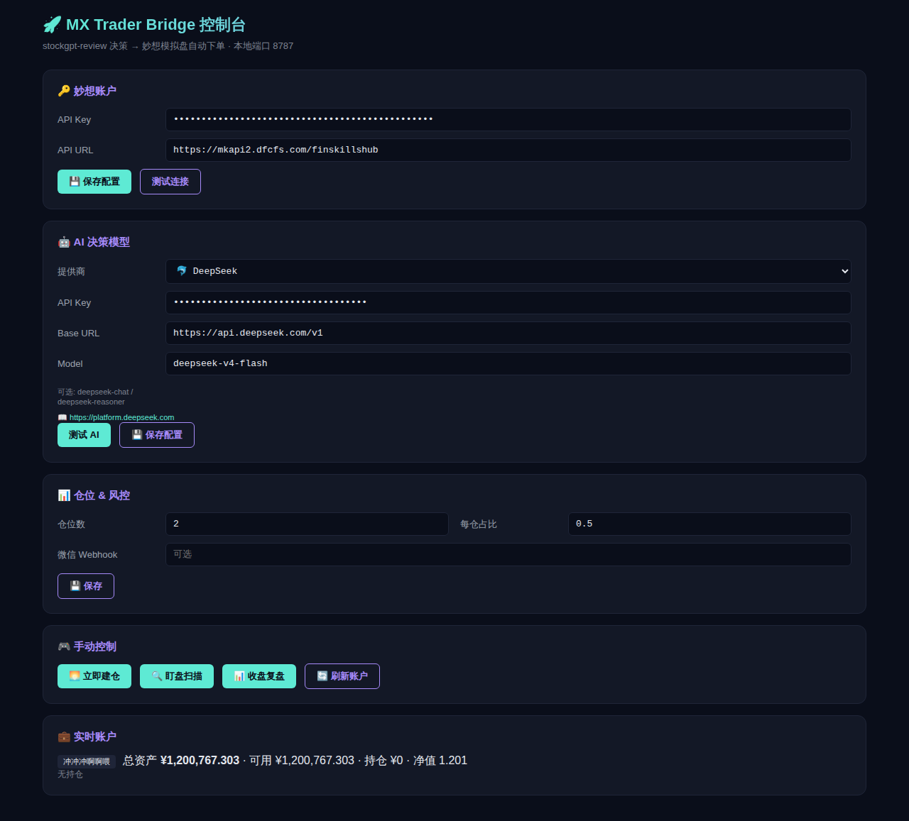

# 🚀 MX Trader Bridge

> **stockgpt-review 决策大脑 → 东方财富妙想模拟盘自动执行**的桥接层
> A股全自动模拟交易系统：AI 选股 + AI 风控 + 自动下单 + 每日复盘 + 周度反思迭代

[](https://opensource.org/licenses/MIT)
[](https://www.python.org/)
[](https://github.com/27dream/mx-trader-bridge)

## 📸 控制台预览



> 一个本地 Flask 面板（端口 8787），BYOK 配置 5 大主流 LLM，一键测试 / 保存 / 手动触发交易流程

## ✨ 特性

- 🤖 **BYOK 多 LLM 支持** — 字节豆包 ARK / DeepSeek / Kimi / 通义千问 / 智谱 GLM / OpenAI / 自定义 7 模板，Web 面板自助切换
- 📊 **2 仓位 × 50%** 默认配置，AI **动态生成**止损/止盈/强平时间参数（不是写死的 -3%）
- 🛡️ **下单前 4 道风控预检**（黑名单/熔断/资金/集中度）— 内嵌 [mx-risk-guard](https://github.com/27dream/mx-risk-guard)
- ✅ **rc=0 + 成交轮询双校验** — 不再被 `code=200` 假成功欺骗（A 股下单成功 ≠ 成交）
- 📣 **多通道告警**（飞书 webhook / Server酱 / 控制台）— 决策/成交/拒单/熔断实时推送
- 🎯 **腾讯实时行情** 接入（盘中 0 延迟）
- 🔁 **周日 AI 反思** — 自动复盘本周战绩，进化下周策略 DSL（复用 BYOK LLM，无第三方依赖）
- 💾 **SQLite 战绩库** — trades / decisions / signals / daily_recap / reflections 五表完整可查
- 🧪 **`e2e_dryrun.py` 全链路自检**（9 步），不下真单也能验证全系统
- 🔒 凭证 chmod 600 存 `~/.mx-trader-bridge/config.json`，**不入仓库**
- ⚡ **0 成本运行** — 全本地 cron，无服务器，无云费用

## 🚀 快速开始

```bash
git clone https://github.com/27dream/mx-trader-bridge
cd mx-trader-bridge
python -m venv .venv && source .venv/bin/activate
pip install -r requirements.txt

# 1. 启 Web 面板配 BYOK
python server.py            # 浏览器打开 http://localhost:8787

# 2. 端到端 dry-run 自检（9 步全链路，不下真单）
python e2e_dryrun.py

# 3. 9/9 通过后挂 cron
crontab -e                  # 粘贴 cron.txt
```

打开面板 → 填妙想 cookie + LLM Key → 点「测试连接」→ 保存 → 跑 dry-run。

## 🏗️ 架构

```
            ┌─────────────────────────┐
            │ stockgpt-review (Vercel)│  ← 看板大脑（可选）
            └──────────┬──────────────┘
                       │ HTTP
            ┌──────────▼──────────────┐
            │   decision.py           │  09:25 AI 选股 + DSL
            └──────────┬──────────────┘
                       │
            ┌──────────▼──────────────┐
            │ morning_trade.py        │  09:30 建仓
            │  ├─ 风控预检 (risk_guard.pre_check_buy)  🛡️
            │  ├─ 限价单 trader.buy()
            │  ├─ rc=0 校验 + 成交轮询 verify_filled
            │  └─ notifier 多通道告警 📣
            ├──────────────────────────┤
            │ monitor.py              │  盘中每 5min 盯盘
            │  └─ trader.sell_safe() 双校验
            ├──────────────────────────┤
            │ risk_guard.run()        │  独立护栏 — 单股集中度/单日熔断/回撤/黑名单
            ├──────────────────────────┤
            │ recap.py / reflect.py   │  15:30 复盘 / 周日反思
            └──────────┬──────────────┘
                       │ mx-moni API
            ┌──────────▼──────────────┐
            │  东方财富妙想模拟盘     │  120 万本金练手
            └─────────────────────────┘
```

## 📂 文件结构

| 文件 | 作用 |
|---|---|
| `server.py` | Flask 控制面板（端口 8787） |
| `templates/index.html` | BYOK 配置 UI |
| `trader.py` | 妙想 mx-moni API 封装（含 sell_safe 双校验） |
| `decision.py` | AI 决策（chat() + 选股 DSL） |
| `morning_trade.py` | 09:30 建仓主流程（含风控预检 + 告警） |
| `monitor.py` | 盘中盯盘 + 止损/止盈（sell_safe + 告警） |
| `risk_guard.py` | 独立风控引擎（pre_check_buy + 兜底扫描） |
| `notifier.py` | 飞书 / Server酱 / 控制台 多通道告警 |
| `recap.py` | 15:30 复盘 |
| `reflect.py` | 周日 AI 反思（复用 BYOK chat） |
| `e2e_dryrun.py` | **全链路 9 步自检** ✨ |
| `db.py` | SQLite 数据层 |
| `llm_templates.py` | 7 LLM 模板定义 |
| `config_store.py` | 凭证 chmod 600 安全存储 |
| `cron.txt` | Cron 调度规则 |

## 📅 Cron 调度

```
25 9    * * 1-5  python decision.py        # 09:25 出决策
30 9    * * 1-5  python morning_trade.py   # 09:30 建仓 (含风控预检)
*/5 9-14 * * 1-5 python monitor.py         # 盘中每 5min 盯盘
*/3 9-14 * * 1-5 python risk_guard.py      # 风控护栏（兜底扫描）
30 15   * * 1-5  python recap.py           # 15:30 复盘
0  20   * * 0    python reflect.py         # 周日 20:00 AI 反思
```

## 📣 告警配置（可选）

`.env` 任填一个：

```bash
FEISHU_WEBHOOK=https://open.feishu.cn/open-apis/bot/v2/hook/xxx
SERVERCHAN_KEY=SCTxxxx        # 微信通道
```

不配则只走控制台。日志在 `logs/risk_guard.log`。

## 🤖 支持的 LLM

| 提供商 | 默认模型 | 注册地址 |
|---|---|---|
| 🚀 字节豆包 ARK | `doubao-seed-1.6` | https://www.volcengine.com/product/ark |
| 🐬 DeepSeek | `deepseek-chat` | https://platform.deepseek.com |
| 🌙 月之暗面 Kimi | `moonshot-v1-8k` | https://platform.moonshot.cn |
| 🧠 阿里通义千问 | `qwen-plus` | https://dashscope.aliyun.com |
| 🔮 智谱 GLM | `glm-4-flash` | https://open.bigmodel.cn |
| 🤖 OpenAI | `gpt-4o-mini` | https://platform.openai.com |
| ⚙️ 自定义 | OpenAI 兼容 | 任意网关 |

## ⚠️ 风险声明

**仅用于东方财富妙想模拟盘**学习研究，不操作真实资金，不构成任何投资建议。
A股有风险，量化需谨慎。

## 📜 License

MIT — 随便玩，star 一下回血 ⭐

## 🔗 相关项目

- [stockgpt-review](https://github.com/27dream/stockgpt-review) — 配套的 AI 决策大脑（Vercel 部署）
- [mcp-eastmoney](https://github.com/27dream/mcp-eastmoney) — 东方财富 MCP Server
